# PIDM Codebase — Control Flow Guide

> A layered walkthrough of how this codebase works, from the big picture down to
> individual function calls. Each section zooms one level deeper.
>
> **How to read this:** Start at Level 0. Only drill into the levels you need.
> All file links are clickable and jump directly to source.

---

## Legend

Every diagram in this document uses the same visual language:

| Shape | Meaning |
|-------|---------|
| Rounded box `([...])` | Entry point (CLI command) |
| Rectangle `[...]` | Process / function call |
| Diamond `{...}` | Decision |
| Cylinder `[(...)]` | Data at rest (files on disk) |
| Dashed arrow `-.->`  | Reads from / depends on |
| Solid arrow `-->` | Calls / flows into |

Color coding:


---

## Level 0 — The Big Picture

There are exactly **three things you can do** with this codebase.
Each one is a single CLI command.

```mermaid
flowchart LR
    RECORD(["python -m\npidm_imitation.environment.toy_env.play"]) --> TRAJ[("Trajectory files\ndatasets/")]
    TRAJ -.-> TRAIN(["python -m\npidm_imitation.agents.supervised_learning.train"])
    TRAIN --> CKPT[("Model checkpoint\ncheckpoints/*.ckpt")]
    CKPT -.-> EVAL(["python -m\npidm_imitation.toy_evaluate_model"])
    EVAL --> RESULTS[("Metrics + plots\nrollout_trajectories.jpg")]

    style RECORD fill:#6366f1,color:#fff,stroke:#4f46e5
    style TRAIN fill:#f59e0b,color:#fff,stroke:#d97706
    style EVAL fill:#10b981,color:#fff,stroke:#059669
    style TRAJ fill:#313244,color:#cdd6f4,stroke:#585b70
    style CKPT fill:#313244,color:#cdd6f4,stroke:#585b70
    style RESULTS fill:#313244,color:#cdd6f4,stroke:#585b70
```

**In words:** You *record* demonstration trajectories in a toy 2D environment,
*train* an imitation learning model (BC or PIDM/IDM) on those trajectories,
then *evaluate* the trained model by rolling it out in the same environment and
comparing to a reference trajectory.

---

## Level 1 — What Each Command Does (5 steps each)

### 1A · Data Recording

You run an agent (human, random, or A*) in the toy 2D grid environment and
save the resulting trajectories to disk.

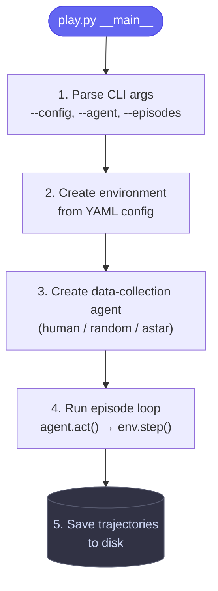

**Step-by-step with code:**

| Step | What happens | Code | File |
|------|-------------|------|------|
| 1 | Parse CLI args (`--config`, `--agent`, `--episodes`, `--record`) | `parse_args()` | [play.py:83-87](file:///home/martyna/Documents/Avi/pidm_warm_start_rl/pidm_imitation/environment/toy_env/play.py#L83-L87) |
| 2 | Build env config from args, then create environment | `create_toy_config_from_args(args)` → `ToyEnvironmentFactory.create_environment(env_config)` | [utils.py](file:///home/martyna/Documents/Avi/pidm_warm_start_rl/pidm_imitation/environment/toy_env/utils.py) · [toy_factory.py](file:///home/martyna/Documents/Avi/pidm_warm_start_rl/pidm_imitation/environment/toy_env/toy_factory.py) |
| 3 | Instantiate data-collection agent for the env | `get_agent(env, agent_type)` | [data_collection_agents.py](file:///home/martyna/Documents/Avi/pidm_warm_start_rl/pidm_imitation/environment/toy_env/data_collection_agents.py) |
| 4 | Loop over episodes; each episode runs `play_episode()` which calls `agent.act()` → `env.step(action)` in a while-loop | `play_episodes()` → `play_episode()` | [play.py:90-151](file:///home/martyna/Documents/Avi/pidm_warm_start_rl/pidm_imitation/environment/toy_env/play.py#L90-L151) |
| 5 | Serialize trajectory to disk (video + JSON) | `recorded_trajectory.save_to_dir(experiment_dir, traj_name)` | [toy_trajectory.py](file:///home/martyna/Documents/Avi/pidm_warm_start_rl/pidm_imitation/environment/toy_env/toy_trajectory.py) |

**Core episode loop** in [play.py:120-151](file:///home/martyna/Documents/Avi/pidm_warm_start_rl/pidm_imitation/environment/toy_env/play.py#L120-L151):
```python
while not done:
    action = agent.act()
    obs, reward, done, truncated, _ = env.step(action)
    state = env.get_state()
    frame = env.render()
    recording.add_step(frame=frame, other_data={"obs": obs, "action": action, ...})
```

---

### 1B · Training

You point the training script at a config YAML, which specifies *everything*:
data paths, model architecture, optimizer, callbacks.

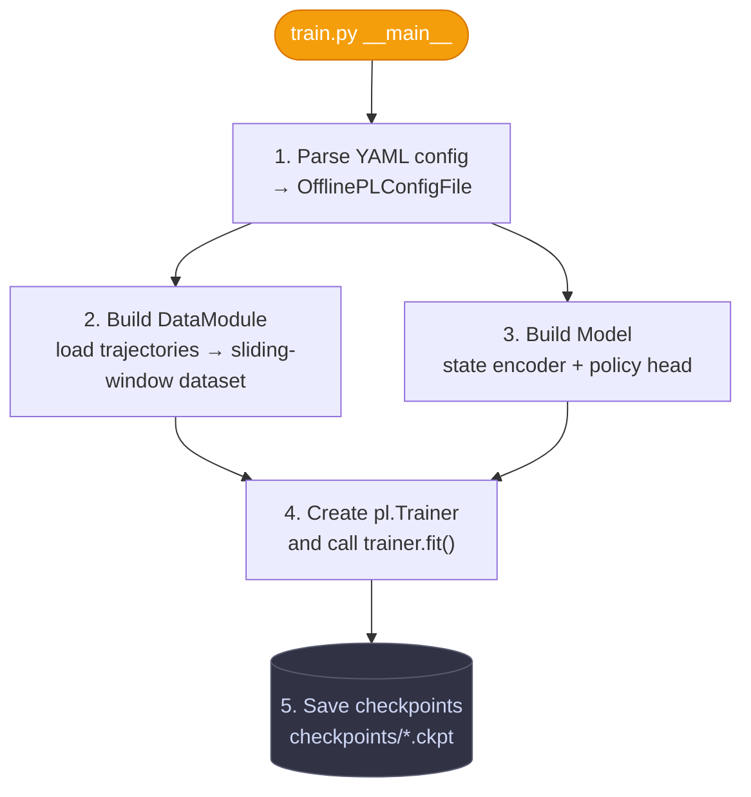

**Step-by-step with code:**

| Step | What happens | Code | File |
|------|-------------|------|------|
| 1 | Load and validate YAML config | `OfflinePLConfigFile(args.config)` → `sanity_check_config(config)` | [train.py:110-111](file:///home/martyna/Documents/Avi/pidm_warm_start_rl/pidm_imitation/agents/supervised_learning/train.py#L110-L111) · [config_offline_pl.py](file:///home/martyna/Documents/Avi/pidm_warm_start_rl/pidm_imitation/configs/config_offline_pl.py) |
| 2 | Create data module (load trajectories, build sliding-window datasets) | `DataModuleFactory.get_datamodule(config, output_dir=checkpoint_dir)` | [train.py:136-138](file:///home/martyna/Documents/Avi/pidm_warm_start_rl/pidm_imitation/agents/supervised_learning/train.py#L136-L138) · [datamodule_factory.py](file:///home/martyna/Documents/Avi/pidm_warm_start_rl/pidm_imitation/agents/supervised_learning/dataset/datamodule_factory.py) |
| 3 | Assemble model from factories (state encoder + policy head) | `ModelFactory.get_model(config, datamodule)` | [train.py:139](file:///home/martyna/Documents/Avi/pidm_warm_start_rl/pidm_imitation/agents/supervised_learning/train.py#L139) · [model_factory.py:200-213](file:///home/martyna/Documents/Avi/pidm_warm_start_rl/pidm_imitation/agents/supervised_learning/model_factory.py#L200-L213) |
| 4 | Create Lightning Trainer with callbacks/logger and start training | `pl.Trainer(callbacks=callbacks, logger=logger, **trainer_kwargs)` → `trainer.fit(model=model, datamodule=datamodule)` | [train.py:151-156](file:///home/martyna/Documents/Avi/pidm_warm_start_rl/pidm_imitation/agents/supervised_learning/train.py#L151-L156) |
| 5 | Checkpoints saved by `ModelCheckpoint` callback to `dirpath` | Configured via `callbacks.checkpoint_callback_kwargs` in YAML | [pidm_example.yaml:50-66](file:///home/martyna/Documents/Avi/pidm_warm_start_rl/configs/supervised_learning/pidm_example.yaml#L50-L66) |

**Entry point** in [train.py:108-156](file:///home/martyna/Documents/Avi/pidm_warm_start_rl/pidm_imitation/agents/supervised_learning/train.py#L108-L156):
```python
if __name__ == "__main__":
    args = parse_args()
    config = OfflinePLConfigFile(args.config)
    sanity_check_config(config)
    # ...
    datamodule = DataModuleFactory.get_datamodule(config=config, output_dir=checkpoint_dir)
    model = ModelFactory.get_model(config, datamodule)
    # ...
    trainer = pl.Trainer(callbacks=callbacks, logger=logger, **trainer_kwargs)
    trainer.fit(model=model, datamodule=datamodule, **config.pl_config.fit_kwargs)
```

---

### 1C · Evaluation

You load a trained checkpoint, create an inference agent, run it in the
environment, and compute metrics against a reference trajectory.

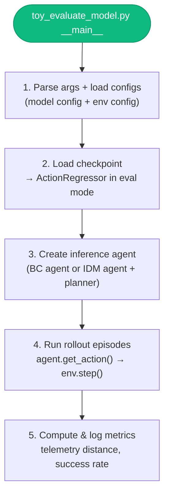

**Step-by-step with code:**

| Step | What happens | Code | File |
|------|-------------|------|------|
| 1 | Parse CLI args, build eval context and configs | `ToyEvaluationContext(parse_args())` → `evaluate_common_setup(args, ...)` | [toy_evaluate_model.py:107-116](file:///home/martyna/Documents/Avi/pidm_warm_start_rl/pidm_imitation/toy_evaluate_model.py#L107-L116) |
| 2 | Load model from checkpoint, set to eval mode | `PytorchAgentFactory.create_model_and_load_checkpoint(config, checkpoint_file)` | [pytorch_agents_factory.py:121-144](file:///home/martyna/Documents/Avi/pidm_warm_start_rl/pidm_imitation/agents/supervised_learning/inference_agents/pytorch_agents_factory.py#L121-L144) |
| 3 | Select agent class based on type (bc/idm) and wrap model | `PytorchAgentFactory.get_agent(agent_name, config, ...)` | [pytorch_agents_factory.py:146-175](file:///home/martyna/Documents/Avi/pidm_warm_start_rl/pidm_imitation/agents/supervised_learning/inference_agents/pytorch_agents_factory.py#L146-L175) |
| 4 | Run episodes via `ToyEnvExperiment.run()` | `exp.run()` — loops over episodes, calls `agent.get_action()` → `env.step()` | [toy_env_experiments.py:237-340](file:///home/martyna/Documents/Avi/pidm_warm_start_rl/pidm_imitation/evaluation/toy_env_experiments.py#L237-L340) |
| 5 | Compute and log metrics (telemetry distance, goal completion, etc.) | `ToyEnvExperimentResult.compute_metrics(...)` | [toy_env_experiments.py:140-169](file:///home/martyna/Documents/Avi/pidm_warm_start_rl/pidm_imitation/evaluation/toy_env_experiments.py#L140-L169) |

**Agent creation** in [toy_evaluate_model.py:84-104](file:///home/martyna/Documents/Avi/pidm_warm_start_rl/pidm_imitation/toy_evaluate_model.py#L84-L104):
```python
def create_agent(context, config, env_config, env) -> Agent:
    return ToyPytorchAgentWrapperFactory.get_agent(
        agent_name=context.agent_name,
        model_path=context.checkpoint_dir,
        checkpoint_name=context.checkpoint,
        config=config,
        video_height=video_height, video_width=video_width,
        env=env,
        input_trajectories=context.input_trajectories,
    )
```

---

## Level 2 — Training Deep Dive

Training is the most complex pipeline. This section breaks it into its two
major subsystems: the **data pipeline** and the **model pipeline**, then shows
how they connect in the training loop.

### 2A · Config Structure

Every training run is driven by a single YAML file
(e.g. [pidm_example.yaml](file:///home/martyna/Documents/Avi/pidm_warm_start_rl/configs/supervised_learning/pidm_example.yaml)).
Here's how the top-level keys map to Python config classes:

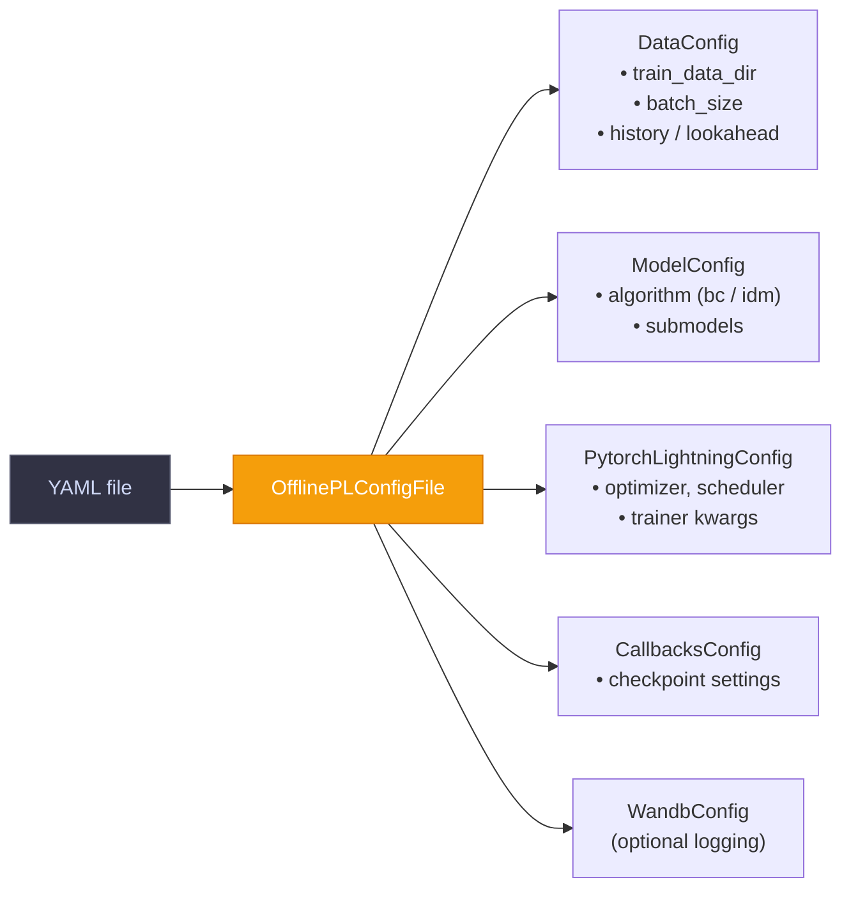

| YAML key | Python class | Defined in |
|----------|-------------|------------|
| `data:` | `DataConfig` | [dataset/config/subconfig.py](file:///home/martyna/Documents/Avi/pidm_warm_start_rl/pidm_imitation/agents/supervised_learning/dataset/config/subconfig.py) |
| `model:` | `ModelConfig` | [agents/supervised_learning/config/subconfig.py](file:///home/martyna/Documents/Avi/pidm_warm_start_rl/pidm_imitation/agents/supervised_learning/config/subconfig.py) |
| `state:` | `StateConfig` | [configs/subconfig.py:177-200](file:///home/martyna/Documents/Avi/pidm_warm_start_rl/pidm_imitation/configs/subconfig.py#L177-L200) |
| `action:` | `ControllerActionConfig` | [configs/subconfig.py:203-226](file:///home/martyna/Documents/Avi/pidm_warm_start_rl/pidm_imitation/configs/subconfig.py#L203-L226) |
| `pytorch_lightning:` | `PytorchLightningConfig` | [configs/subconfig.py:229-267](file:///home/martyna/Documents/Avi/pidm_warm_start_rl/pidm_imitation/configs/subconfig.py#L229-L267) |
| `callbacks:` | `CallbacksConfig` | [configs/subconfig.py:270-297](file:///home/martyna/Documents/Avi/pidm_warm_start_rl/pidm_imitation/configs/subconfig.py#L270-L297) |
| `wandb:` | `WandbConfig` | [configs/subconfig.py:20-76](file:///home/martyna/Documents/Avi/pidm_warm_start_rl/pidm_imitation/configs/subconfig.py#L20-L76) |

All sub-configs are parsed in [OfflinePLConfigFile._create_sub_configs()](file:///home/martyna/Documents/Avi/pidm_warm_start_rl/pidm_imitation/configs/config_offline_pl.py#L61-L69):
```python
def _create_sub_configs(self) -> None:
    self.data_config = self._get_simple_config_obj(DataConfig)
    self.model_config = self._get_simple_config_obj(ModelConfig)
    self.state_config = self._get_simple_config_obj(StateConfig)
    self.action_config = self._get_simple_config_obj(ControllerActionConfig)
    self.pl_config = self._get_simple_config_obj(PytorchLightningConfig)
    self.callbacks_config = self._get_simple_config_obj(CallbacksConfig)
    self.wandb_config = self._get_simple_config_obj(WandbConfig)
```

---

### 2B · Data Pipeline

The data pipeline turns raw trajectory files into batched tensors.

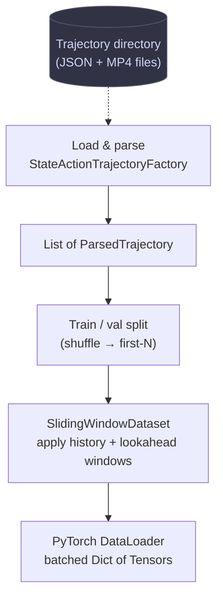

| Step | Code | File |
|------|------|------|
| Load trajectories from disk | `StateActionTrajectoryFactory.get_trajectory_by_state_type(state_type, datapath, ...)` | [state_action_trajectory.py](file:///home/martyna/Documents/Avi/pidm_warm_start_rl/pidm_imitation/agents/supervised_learning/dataset/state_action_trajectory.py) |
| Sort + shuffle + split into train/val | `DataModule._load_data()` → `_train_val_split()` | [datamodule.py:296-345](file:///home/martyna/Documents/Avi/pidm_warm_start_rl/pidm_imitation/agents/supervised_learning/dataset/datamodule.py#L296-L345) |
| Build sliding-window datasets | `DataModule._build_dataset()` → `SlidingWindowDataset(history, lookahead, ...)` | [datamodule.py:347-369](file:///home/martyna/Documents/Avi/pidm_warm_start_rl/pidm_imitation/agents/supervised_learning/dataset/datamodule.py#L347-L369) · [sliding_window_dataset.py](file:///home/martyna/Documents/Avi/pidm_warm_start_rl/pidm_imitation/agents/supervised_learning/dataset/sliding_window_dataset.py) |
| Wrap in DataLoader | `DataModule.train_dataloader()` | [datamodule.py:380-387](file:///home/martyna/Documents/Avi/pidm_warm_start_rl/pidm_imitation/agents/supervised_learning/dataset/datamodule.py#L380-L387) |
| Factory entry point | `DataModuleFactory.get_datamodule(config, output_dir)` | [datamodule_factory.py:13-55](file:///home/martyna/Documents/Avi/pidm_warm_start_rl/pidm_imitation/agents/supervised_learning/dataset/datamodule_factory.py#L13-L55) |

The sliding window is the core idea: for each timestep *t*, the dataset
produces a dict containing states and actions from `[t - history, t + lookahead]`,
sampled at positions defined by a [Slicer](file:///home/martyna/Documents/Avi/pidm_warm_start_rl/pidm_imitation/agents/supervised_learning/dataset/slicer.py).

---

### 2C · Model Pipeline

The model is assembled via a chain of factories. Both BC and IDM use the same
`SingleHeadActionRegressor` — the only difference is which *inputs* each head
receives (BC sees the current state; IDM sees current + future state).

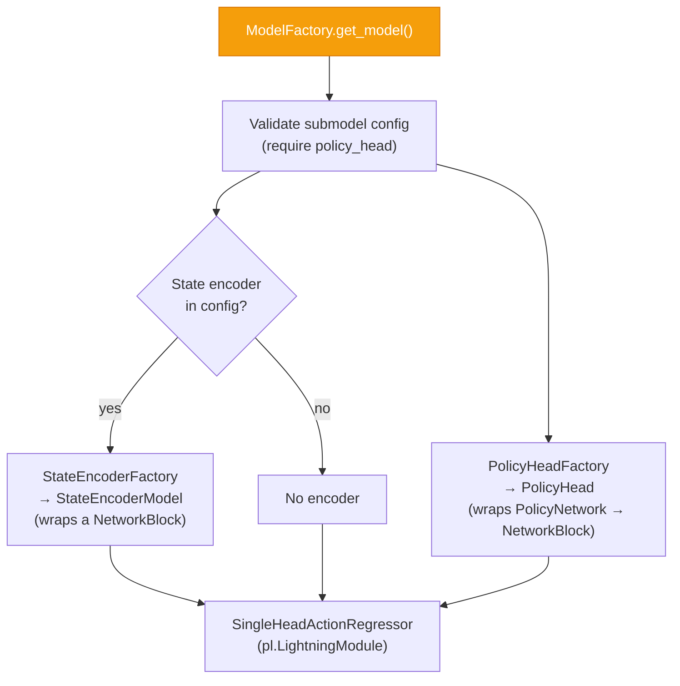

| Step | Code | File |
|------|------|------|
| Entry point — validate config and build model | `ModelFactory.get_model(config, datamodule)` | [model_factory.py:200-213](file:///home/martyna/Documents/Avi/pidm_warm_start_rl/pidm_imitation/agents/supervised_learning/model_factory.py#L200-L213) |
| Select model class (BC → `SingleHeadActionRegressor`, IDM → same) | `ModelFactory.get_model_class(alg)` | [model_factory.py:104-114](file:///home/martyna/Documents/Avi/pidm_warm_start_rl/pidm_imitation/agents/supervised_learning/model_factory.py#L104-L114) |
| Build state encoder from config | `StateEncoderFactory.get_state_encoder(config, state_dim)` | [submodel_factories.py:153-183](file:///home/martyna/Documents/Avi/pidm_warm_start_rl/pidm_imitation/agents/supervised_learning/submodel_factories.py#L153-L183) |
| Build policy head from config | `PolicyHeadFactory.get_policy_head(config, state_dim, ...)` | [submodel_factories.py:321-337](file:///home/martyna/Documents/Avi/pidm_warm_start_rl/pidm_imitation/agents/supervised_learning/submodel_factories.py#L321-L337) |
| Assemble into `SingleHeadActionRegressor` | `SingleHeadActionRegressor(state_encoder_model, policy_head, ...)` | [single_head_model.py:17-48](file:///home/martyna/Documents/Avi/pidm_warm_start_rl/pidm_imitation/agents/supervised_learning/single_head_model.py#L17-L48) |
| Underlying network blocks | `NetworkBlock` (configurable Linear/ReLU/BatchNorm stack) | [network_block.py](file:///home/martyna/Documents/Avi/pidm_warm_start_rl/pidm_imitation/agents/models/network_block.py) |

**Model assembly** in [model_factory.py:200-213](file:///home/martyna/Documents/Avi/pidm_warm_start_rl/pidm_imitation/agents/supervised_learning/model_factory.py#L200-L213):
```python
@staticmethod
def get_model(config, datamodule) -> ActionRegressor:
    ModelFactory.assert_required_and_valid_submodels(config)
    alg = ExtractArgsFromConfig.get_algorithm(config)
    model_class = ModelFactory.get_model_class(alg)
    model_kwargs = ModelFactory.get_model_kwargs(alg, config, datamodule)
    model = model_class(**model_kwargs)
    ModelFactory.assert_valid_model_datamodule(model, datamodule)
    return model
```

---

### 2D · Training Loop (inside PyTorch Lightning)

Once `trainer.fit()` is called, Lightning manages the loop. Here's what
happens on each training step:

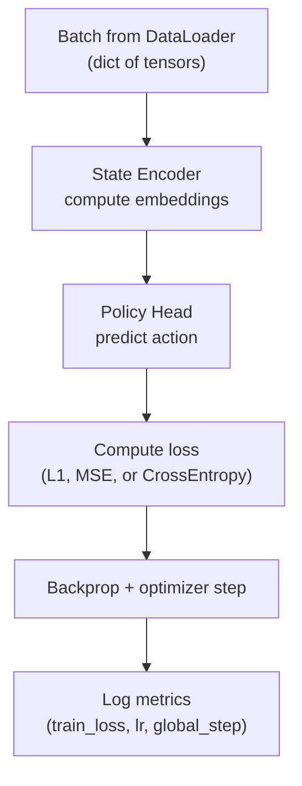

| Step | Code | File |
|------|------|------|
| `training_step` dispatches to common logic | `ActionRegressor.training_step(batch, batch_idx)` | [base_models.py:250-259](file:///home/martyna/Documents/Avi/pidm_warm_start_rl/pidm_imitation/agents/supervised_learning/base_models.py#L250-L259) |
| Common step: encode → predict → loss | `SingleHeadActionRegressor._common_training_validation_step(batch)` | [single_head_model.py:50-76](file:///home/martyna/Documents/Avi/pidm_warm_start_rl/pidm_imitation/agents/supervised_learning/single_head_model.py#L50-L76) |
| Compute state embeddings | `ActionRegressor._compute_encoder_embeddings(inputs)` | [base_models.py:119-134](file:///home/martyna/Documents/Avi/pidm_warm_start_rl/pidm_imitation/agents/supervised_learning/base_models.py#L119-L134) |
| Forward through policy head | `self.policy_head(policy_inputs)` → returns predicted action | [policy_heads.py](file:///home/martyna/Documents/Avi/pidm_warm_start_rl/pidm_imitation/agents/supervised_learning/submodels/policy_heads.py) |
| Compute per-head loss and total loss | `ActionRegressor._compute_losses(predicted, target)` | [base_models.py:161-190](file:///home/martyna/Documents/Avi/pidm_warm_start_rl/pidm_imitation/agents/supervised_learning/base_models.py#L161-L190) |
| Loss function implementation | `ActionLoss` (wraps L1 / MSE / CrossEntropy) | [action_loss.py](file:///home/martyna/Documents/Avi/pidm_warm_start_rl/pidm_imitation/agents/supervised_learning/utils/action_loss.py) |
| Configure optimizer + scheduler | `ActionRegressor.configure_optimizers()` | [base_models.py:99-111](file:///home/martyna/Documents/Avi/pidm_warm_start_rl/pidm_imitation/agents/supervised_learning/base_models.py#L99-L111) |

**The core training step** in [single_head_model.py:50-76](file:///home/martyna/Documents/Avi/pidm_warm_start_rl/pidm_imitation/agents/supervised_learning/single_head_model.py#L50-L76):
```python
def _common_training_validation_step(self, batch, training=True):
    self.reset()
    state_embeddings = self._compute_encoder_embeddings(batch)
    policy_inputs = {**batch, **state_embeddings}
    policy_outputs = self.policy_head(policy_inputs)
    policy_target_key = self.policy_head.get_target_key()
    head_predictions = {POLICY_HEAD_KEY: policy_outputs}
    head_targets = {POLICY_HEAD_KEY: batch[policy_target_key]}
    return self._compute_total_loss_and_log_losses(
        predicted=head_predictions, target=head_targets, training=training,
    )
```

---

## Level 3 — Evaluation Deep Dive

### 3A · Inference Agent Creation

Loading a checkpoint and wrapping it as an interactive agent:

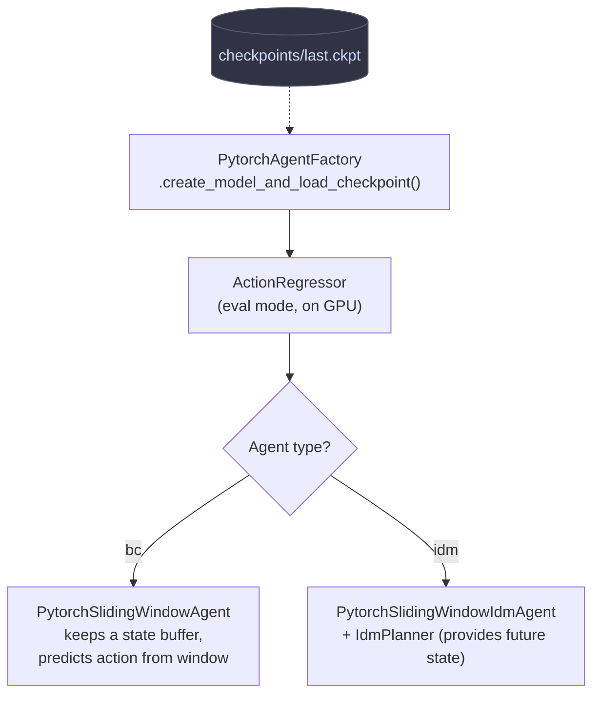

| Step | Code | File |
|------|------|------|
| Resolve checkpoint file path | `PytorchAgentFactory.get_checkpoint_file(model_path, checkpoint_name, ...)` | [pytorch_agents_factory.py:106-119](file:///home/martyna/Documents/Avi/pidm_warm_start_rl/pidm_imitation/agents/supervised_learning/inference_agents/pytorch_agents_factory.py#L106-L119) |
| Load checkpoint into model, set eval mode | `model_class.load_from_checkpoint(checkpoint_file)` → `model.eval()` | [pytorch_agents_factory.py:121-144](file:///home/martyna/Documents/Avi/pidm_warm_start_rl/pidm_imitation/agents/supervised_learning/inference_agents/pytorch_agents_factory.py#L121-L144) |
| Select agent class based on algorithm + recurrence | `PytorchAgentFactory._get_agent_class(agent_name, model)` | [pytorch_agents_factory.py:44-56](file:///home/martyna/Documents/Avi/pidm_warm_start_rl/pidm_imitation/agents/supervised_learning/inference_agents/pytorch_agents_factory.py#L44-L56) |
| For IDM: create planner to provide future states | `IdmPlannerFactory.get_idm_planner(config, device, ...)` | [pytorch_agents_factory.py:64-75](file:///home/martyna/Documents/Avi/pidm_warm_start_rl/pidm_imitation/agents/supervised_learning/inference_agents/pytorch_agents_factory.py#L64-L75) |
| Agent implementations (sliding window, IDM, recurrent) | `PytorchSlidingWindowAgent`, `PytorchSlidingWindowIdmAgent`, etc. | [pytorch_agents.py](file:///home/martyna/Documents/Avi/pidm_warm_start_rl/pidm_imitation/agents/supervised_learning/inference_agents/pytorch_agents.py) |

**Checkpoint loading** in [pytorch_agents_factory.py:132-144](file:///home/martyna/Documents/Avi/pidm_warm_start_rl/pidm_imitation/agents/supervised_learning/inference_agents/pytorch_agents_factory.py#L132-L144):
```python
model: ActionRegressor = model_class.load_from_checkpoint(
    checkpoint_file, map_location=device
)
model.eval()
model.to(device)
checkpoint = torch.load(checkpoint_file, map_location=device, weights_only=False)
model_hparams = checkpoint.get("hyper_parameters", {})
datamodule_hparams = checkpoint.get("datamodule_hyper_parameters", {})
```

---

### 3B · BC vs IDM at Inference Time

This is the critical architectural difference:

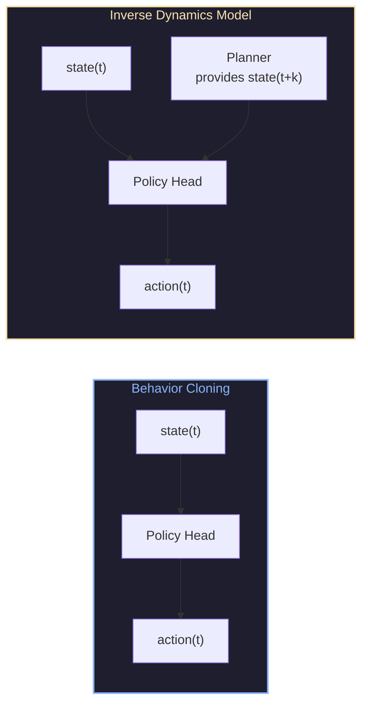

- **BC** predicts actions from the current state alone.
  See [ValidModels.BC](file:///home/martyna/Documents/Avi/pidm_warm_start_rl/pidm_imitation/utils/valid_models.py) and how `input_format: state_only` is handled in [inputs_factory.py](file:///home/martyna/Documents/Avi/pidm_warm_start_rl/pidm_imitation/agents/supervised_learning/inputs_factory.py).

- **IDM** predicts what action would move from state(t) to state(t+k).
  At inference time it needs a **planner** to supply the target future state.
  The planner finds the closest point in a reference trajectory (by L2 distance).
  See [idm_planners.py](file:///home/martyna/Documents/Avi/pidm_warm_start_rl/pidm_imitation/agents/supervised_learning/inference_agents/idm/idm_planners.py) and
  [idm_planners_factory.py](file:///home/martyna/Documents/Avi/pidm_warm_start_rl/pidm_imitation/agents/supervised_learning/inference_agents/idm/idm_planners_factory.py).

---

### 3C · Rollout & Metrics

Each evaluation episode follows this loop
(in [ToyEnvExperiment.run()](file:///home/martyna/Documents/Avi/pidm_warm_start_rl/pidm_imitation/evaluation/toy_env_experiments.py#L237-L340)):

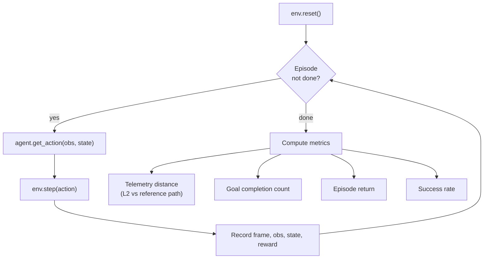

| Metric | Code | File |
|--------|------|------|
| Telemetry distance (normalised L2 to reference path) | `ToyEnvExperimentResult._compute_telemetry_distance(rollout)` | [toy_env_experiments.py:48-91](file:///home/martyna/Documents/Avi/pidm_warm_start_rl/pidm_imitation/evaluation/toy_env_experiments.py#L48-L91) |
| Goal completion count | `ToyEnvExperimentResult._compute_goal_completion_count(rollout)` | [toy_env_experiments.py:93-114](file:///home/martyna/Documents/Avi/pidm_warm_start_rl/pidm_imitation/evaluation/toy_env_experiments.py#L93-L114) |
| Final goal distance | `ToyEnvExperimentResult._compute_final_goal_distances(rollout)` | [toy_env_experiments.py:116-138](file:///home/martyna/Documents/Avi/pidm_warm_start_rl/pidm_imitation/evaluation/toy_env_experiments.py#L116-L138) |
| Aggregate log dict (avg success, avg step count, etc.) | `ToyEnvExperimentResult.get_log_dict()` | [toy_env_experiments.py:171-193](file:///home/martyna/Documents/Avi/pidm_warm_start_rl/pidm_imitation/evaluation/toy_env_experiments.py#L171-L193) |
| Draw trajectory traces | `draw_telemetry_traces(env_config, telemetries_by_name, ...)` | [draw_toy_trajectories.py](file:///home/martyna/Documents/Avi/pidm_warm_start_rl/pidm_imitation/environment/toy_env/draw_toy_trajectories.py) |

**Rollout loop** in [toy_env_experiments.py:273-309](file:///home/martyna/Documents/Avi/pidm_warm_start_rl/pidm_imitation/evaluation/toy_env_experiments.py#L273-L309):
```python
while not ep_finished:
    action = self.agent.get_action(
        raw_obs=frame,
        built_obs={
            StateType.OBSERVATIONS.value: obs,
            StateType.STATES.value: state,
            "frame": frame,
        },
    )
    obs, reward, done, truncated, info = self.env.step(action)
    frame = self.env.render()
    state = self.env.get_state()
    recording.add_step(frame=frame, other_data={...})
```

---

## Quick Reference — File Index

All paths below are relative to `pidm_imitation/`. Click to open.

| Area | File | One-line purpose |
|------|------|------------------|
| **Recording** | [play.py](file:///home/martyna/Documents/Avi/pidm_warm_start_rl/pidm_imitation/environment/toy_env/play.py) | CLI entry: record demonstrations |
| | [toy_environment_base.py](file:///home/martyna/Documents/Avi/pidm_warm_start_rl/pidm_imitation/environment/toy_env/toy_environment_base.py) | Environment: `reset`, `step`, `render` |
| | [toy_environment_goal.py](file:///home/martyna/Documents/Avi/pidm_warm_start_rl/pidm_imitation/environment/toy_env/toy_environment_goal.py) | Goal-reaching environment variant |
| | [toy_trajectory.py](file:///home/martyna/Documents/Avi/pidm_warm_start_rl/pidm_imitation/environment/toy_env/toy_trajectory.py) | Trajectory recording & serialization |
| | [data_collection_agents.py](file:///home/martyna/Documents/Avi/pidm_warm_start_rl/pidm_imitation/environment/toy_env/data_collection_agents.py) | Human / random / A* data-collection agents |
| **Config** | [config_offline_pl.py](file:///home/martyna/Documents/Avi/pidm_warm_start_rl/pidm_imitation/configs/config_offline_pl.py) | Top-level config parser (`OfflinePLConfigFile`) |
| | [configs/subconfig.py](file:///home/martyna/Documents/Avi/pidm_warm_start_rl/pidm_imitation/configs/subconfig.py) | Sub-config classes (Wandb, PL, State, Action, Callbacks) |
| | [pidm_example.yaml](file:///home/martyna/Documents/Avi/pidm_warm_start_rl/configs/supervised_learning/pidm_example.yaml) | Example training config |
| **Training** | [train.py](file:///home/martyna/Documents/Avi/pidm_warm_start_rl/pidm_imitation/agents/supervised_learning/train.py) | CLI entry: launch training |
| | [datamodule_factory.py](file:///home/martyna/Documents/Avi/pidm_warm_start_rl/pidm_imitation/agents/supervised_learning/dataset/datamodule_factory.py) | Build `DataModule` from config |
| | [datamodule.py](file:///home/martyna/Documents/Avi/pidm_warm_start_rl/pidm_imitation/agents/supervised_learning/dataset/datamodule.py) | Data loading, splitting, sliding window creation |
| | [sliding_window_dataset.py](file:///home/martyna/Documents/Avi/pidm_warm_start_rl/pidm_imitation/agents/supervised_learning/dataset/sliding_window_dataset.py) | Window-based `torch.utils.data.Dataset` |
| | [slicer.py](file:///home/martyna/Documents/Avi/pidm_warm_start_rl/pidm_imitation/agents/supervised_learning/dataset/slicer.py) | Computes which indices to sample from windows |
| | [model_factory.py](file:///home/martyna/Documents/Avi/pidm_warm_start_rl/pidm_imitation/agents/supervised_learning/model_factory.py) | Model construction & validation |
| | [submodel_factories.py](file:///home/martyna/Documents/Avi/pidm_warm_start_rl/pidm_imitation/agents/supervised_learning/submodel_factories.py) | Factories for state encoder, policy head, base model |
| | [base_models.py](file:///home/martyna/Documents/Avi/pidm_warm_start_rl/pidm_imitation/agents/supervised_learning/base_models.py) | `ActionRegressor` base class (LightningModule) |
| | [single_head_model.py](file:///home/martyna/Documents/Avi/pidm_warm_start_rl/pidm_imitation/agents/supervised_learning/single_head_model.py) | Single-head BC/IDM model |
| | [network_block.py](file:///home/martyna/Documents/Avi/pidm_warm_start_rl/pidm_imitation/agents/models/network_block.py) | Configurable neural network block |
| | [inputs_factory.py](file:///home/martyna/Documents/Avi/pidm_warm_start_rl/pidm_imitation/agents/supervised_learning/inputs_factory.py) | Determines model input keys from config |
| | [action_loss.py](file:///home/martyna/Documents/Avi/pidm_warm_start_rl/pidm_imitation/agents/supervised_learning/utils/action_loss.py) | Loss function wrapper (L1 / MSE / CrossEntropy) |
| **Evaluation** | [toy_evaluate_model.py](file:///home/martyna/Documents/Avi/pidm_warm_start_rl/pidm_imitation/toy_evaluate_model.py) | CLI entry: run evaluation |
| | [toy_env_experiments.py](file:///home/martyna/Documents/Avi/pidm_warm_start_rl/pidm_imitation/evaluation/toy_env_experiments.py) | Rollout loop, metrics, trajectory drawing |
| | [toy_agents.py](file:///home/martyna/Documents/Avi/pidm_warm_start_rl/pidm_imitation/evaluation/toy_agents.py) | Wraps pytorch agents for toy env |
| | [pytorch_agents_factory.py](file:///home/martyna/Documents/Avi/pidm_warm_start_rl/pidm_imitation/agents/supervised_learning/inference_agents/pytorch_agents_factory.py) | Checkpoint → inference agent |
| | [pytorch_agents.py](file:///home/martyna/Documents/Avi/pidm_warm_start_rl/pidm_imitation/agents/supervised_learning/inference_agents/pytorch_agents.py) | `PytorchAgent` variants (BC, IDM, sliding window) |
| | [draw_toy_trajectories.py](file:///home/martyna/Documents/Avi/pidm_warm_start_rl/pidm_imitation/environment/toy_env/draw_toy_trajectories.py) | Trajectory visualization / plotting |
